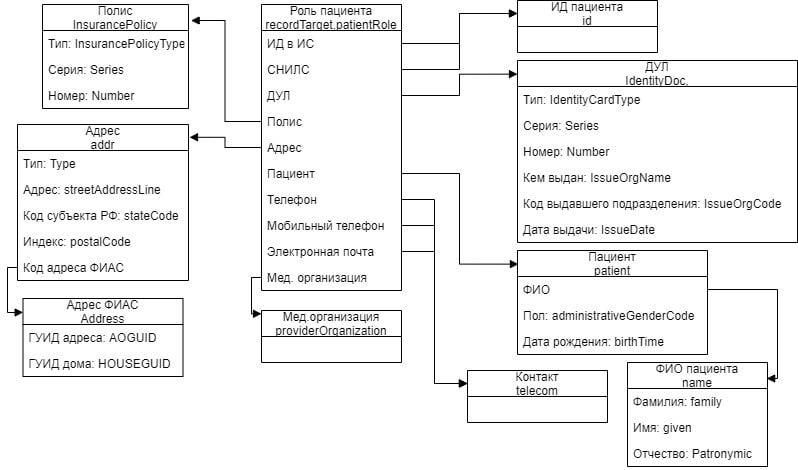
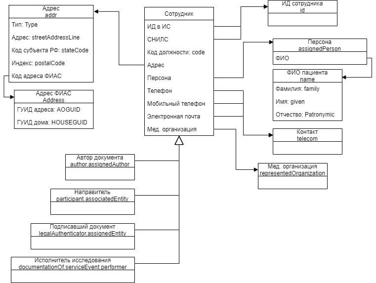
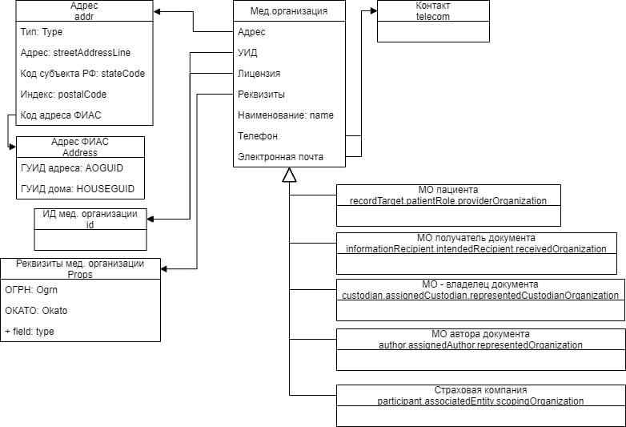

# Протокол лабораторного исследования

Документ описывает работу по кодированию протокола лабораторного исследования (ПЛИ) в FHIR R4. В данный момент уже существует протоколы лабораторного исследования в формате CDA. 

**TODO**: Существует 3 протокола: Клинический и ... Нужно описать и по возможности добавить ссылки

## Задачи

1. Составить список данных используемых в CDA
2. Составить список реусурсов FHIR, кодирующий данные из п.1
3. Разделить список на лабораторные ресурсы и иные
4. Передать требования по иным ресурсам в соответствующие рабочие группы
5. Составить пример заполнения ПЛИ
6. Составить профили на лабораторные ресурсы

### Список ресурсов используемых в CDA

Андрей Звягин написал небольшую программу на VBA, чтобы автоматически получить перечень параметров CDA из максимальных примеров. 

**TODO**: Предлагаю загрузить ссылку на исходный файл ("Протокол_лабораторного_исследования_пример_максимальный.xml") и на программу

Note: Результат работы программы был закодирован в кодировке win1251, файл в данном репозитории перекодирован в utf8.

Результат [работы программы](assets/CDA_definition.txt)

Результат после [импорта в Excel](assets/Примеры_ПЛИ_CDA.xlsx)

Структура Excel файла:

1. Полное имя параметра, где через точку указаны теги, а через нижнее подчеркивание атрибуты
2. Пример содержания
3. Тип (T - тег, A - атрибут)
4. Обязательность (R)
5. Множественность (размерность)
6. Комментарии

Note: В realmCode комментарий плохо структурирован, поэтому обязательность и множественность выбрать автоматом не удалось.

### Список реусурсов FHIR и их соотношение с CDA

**TODO**

### Требования к иным ресурсам 

Андрей Звягин подготовил таблицы спецификации и диаграммы классов не лабораторных ресурсов по документу CDA:

Таблицу спецификации см на вкладках `Пациент`, `Сотрудник` и `Организация` в [примерах ПЛИ CDA](assets/Примеры_ПЛИ_CDA.xlsx)

Пациент

Сотрудник

Организация

### Пример заполнения ПЛИ

**TODO**

### Профили ПЛИ

**TODO**
