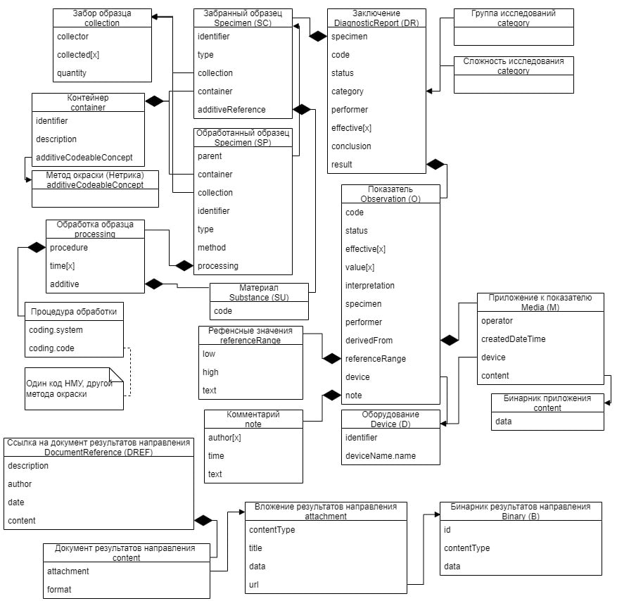

# Получение результатов лабораторного исследования

## Протокол лабораторного исследования

Документ описывает работу по кодированию протокола лабораторного исследования (ПЛИ) в FHIR R4. В данный момент уже существует протоколы лабораторного исследования в формате CDA: Клинический, Цитологический и Гистологический. Мы собираемся создать профиль FHIR с сохранением возможности закодировать все данные из протоколов CDA.

Дополнительно мы планируем проверить данный протокол на задачах коммерческих компаний (Барс, Хеликс, Нетрика, Инвитро)

## Задачи

1. Составить список данных используемых в CDA
2. Составить список реусурсов FHIR, кодирующий данные из п.1
3. Разделить список на лабораторные ресурсы и иные
4. Передать требования по иным ресурсам в соответствующие рабочие группы
5. Составить пример заполнения ПЛИ
6. Составить профили на лабораторные ресурсы

### Список ресурсов используемых в CDA

Текущий результат анализа документов СDA закозирован Андреем Звягиным в [документе](assets/Примеры_ПЛИ_CDA.xlsx)

### Список реусурсов FHIR и их соотношение с CDA

Протокол 1

Протокол 2

Версия Андрея

Версия Александра

### Требования к иным ресурсам 

Текущие требования оформлены в обсуждениях:

* [Пациент](https://github.com/fhir-ru/core/discussions/76)
* [Сотрудник](https://github.com/fhir-ru/core/discussions/77)
* [Организация](https://github.com/fhir-ru/core/discussions/75)

### Пример заполнения ПЛИ

**TODO**

### Профили ПЛИ

**TODO**
